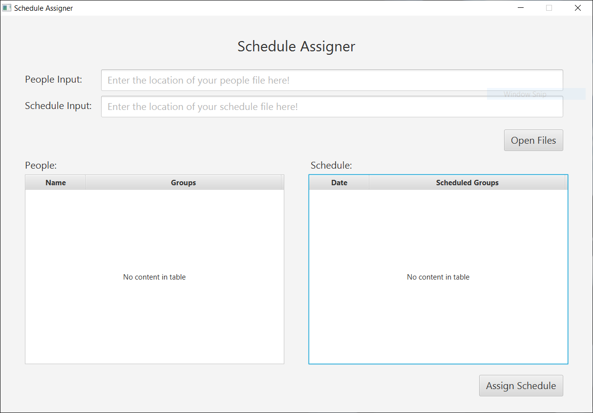
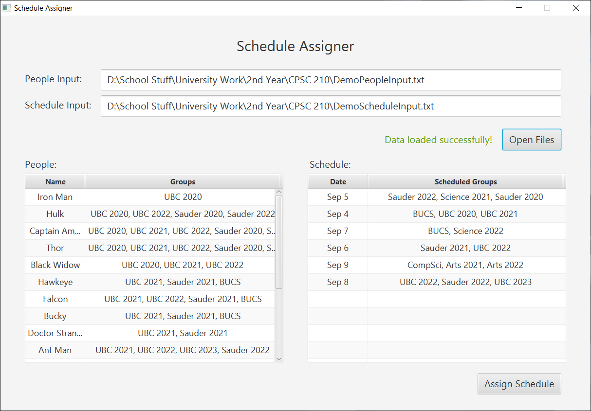
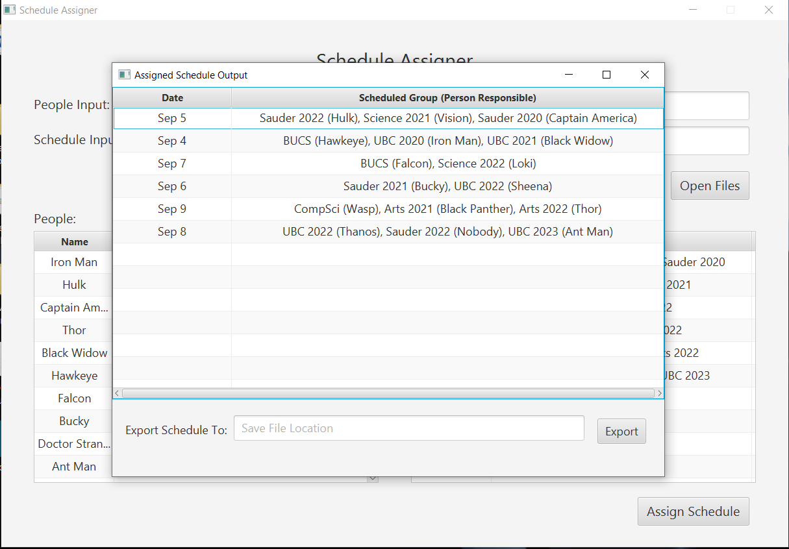
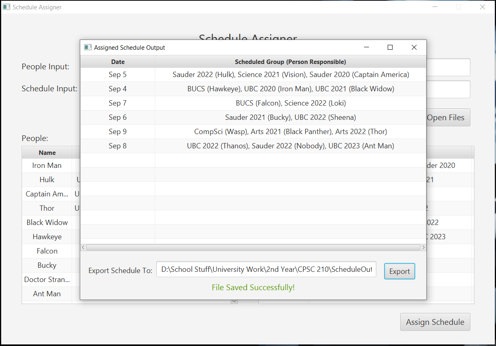
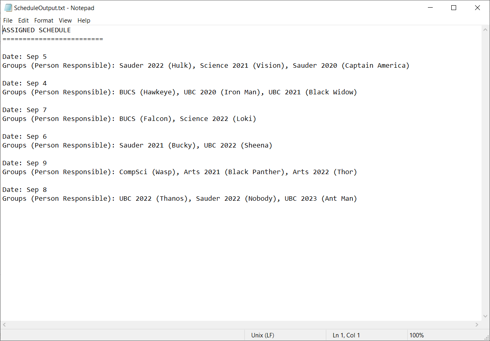
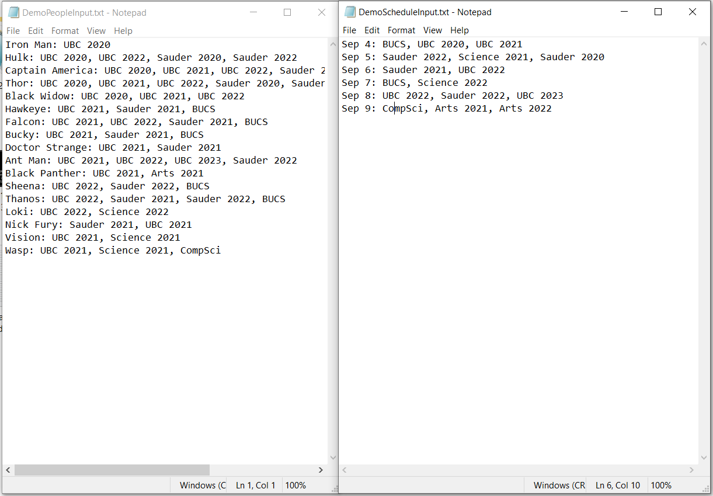
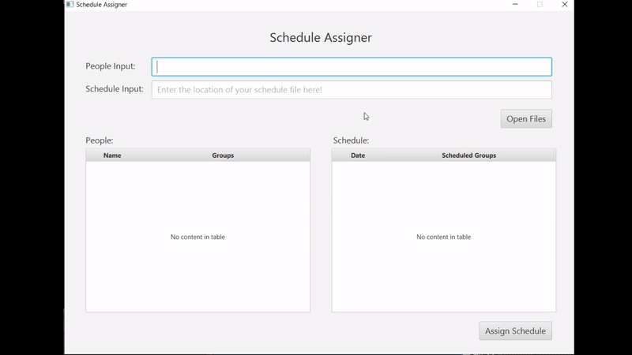

# Schedule Assigner
A simple program that assigns a given list of people to a given schedule.

  

  

## :star: Introduction
This was my final project for the Software Construction Course (CPSC 210) I took during my undergrad at the University of British Columbia (UBC). Although I had started building programs prior to taking this course, I learned how to truly design programs instead of just piecing code together after taking CPSC 210. The funtionalities of this program are definitely not as extensive as what I have built before, but this project was mostly a learning experience on how to design, test, and write cohesive code to create truly robust programs.

Furthermore, this program works as an add-on to my [Sharing Schedule Generator](https://github.com/scheng20/sharing-schedule-generator) program. Essentially, you can take the output of my Sharing Schedule Generator program and use it as the input for this program (convert it to a .txt file and use it as the schedule input file).

## :pushpin: Features 
**Note:** To fully understand the features here, I would highly suggest reading the [README.md file](https://github.com/scheng20/sharing-schedule-generator/blob/master/README.md) from my Sharing Schedule Generator program, since this program is essentially an add-on feature for my schedule generator program. 

* Takes in two input text files, a schedule file and a people file, then matches each person to a scheduled group (meaning that person is responsible for sharing the event to that group on that day).

* Basic algorithm that assigns each person to a group based on which groups that person is in, and avoids assigning multiple groups to one person (in order to evenly distrubte the responsibilites).

* Basic handling of exceptions, such as throwing errors when given a flawed filepath, an empty file, and a .txt file with incorrectly formatted contents.

Note: the algorithm isn't perfect since I spent most of the time learning and applying different Object-Oriented Design Principles (such as Single Responsibility and Liskov Substitution) instead of focusing on algorithm development. 
